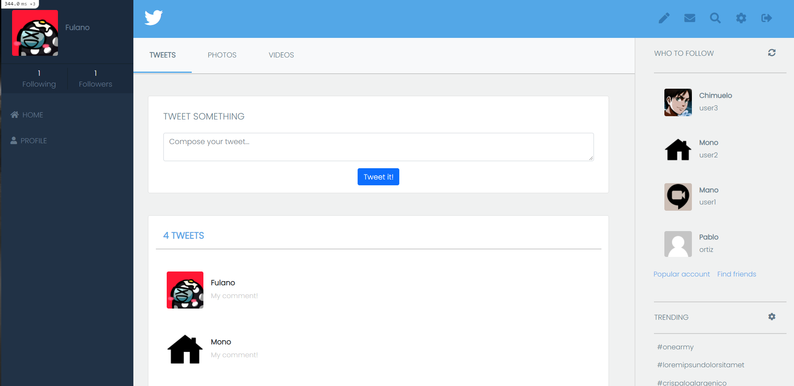
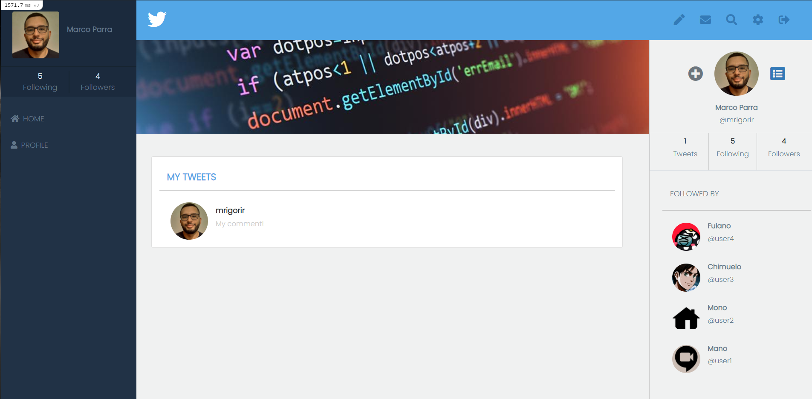

# Twitter MVP

> This is the Ruby on Rails capstone project inspired on [twitter_redesign](https://www.notion.so/Twitter-redesign-f8a8d48453d54d1a949bb0ceab4c8718) I used a lot of knowledge acquired throughout the Ruby on Rails section, MVC, HTML, CSS, and bootstrap concepts, among other knowledge acquired on Microverse to create this MVP app.

## Main Page


## User Page



## What was built in this project:

- The project consists of a Sing up/Login with username only **(as required)**. The user can upload to show on his/her profile/opinions. The images should be provided as URL because I can't store images on the Heroku database, for that, I'm using Active Storage gem so users can upload images without saving their whole format on the app.

- Logged in the user see a timeline with all opinions from users, his/her own name and photo (if uploaded), followings and followers numbers, a "Who to follow" list on the right, and navigation bar with profile edit and logout.

- The user profile view shows a cover image above the specific user opinions and other user's information on the right.

- The functionality to follow/unfollow is very intuitive. '+' button to follow, and if the user wants to stop following, he can do so by pressing the '-' bottom to unfollow. (only visible when the user it's being followed).


## Built With

- Ruby v2.7.0

- Ruby on Rails v5.2.4

- Postgres

- Bootstrap 5

- Font Awesome 5

- Simple form

- Active Storage

- TDD

- VS code

- Linters (RuboCop)

- Stylelint


## Prerequisites

Text Editor (VSCode is suggested.), Ruby Rails Bundler, Yarn, SQL, Postgres

## :star::star: [Live Demo](https://calm-spire-06680.herokuapp.com/) :star::star:


## Getting Started

To get a local copy up and running follow these simple example steps:

- On the project, GitHub page, navigate to the [main page of the repository](https://github.com/mrigorir/twitter_mvp)

- Click on a button named `Code`

- Copy the project URL as displayed on HTTPS tab

- If you're running Windows Operating System, open your command prompt. On Linux, Open your terminal

- Change the current working directory to the location where you want the cloned directory to be made. Leave as it is if the current location is where you want the project to be.

- Type `git clone`, and then paste the URL you copied in Step 3.<br>

  `$ git clone https://github.com/mrigorir/twitter_mvp` <em>Press Enter key</em><br>

- Your local copy will be created.

- Please note that you must have Git installed on your PC, this can be done [here](https://gist.github.com/derhuerst/1b15ff4652a867391f03)

- After you get the project aiming to the desired directory, you need now to install ruby globally and follow the steps below:


### Please note:

- I'm using boostrap CDN, if you want to download it, you can follow these steps:

- add the folowing gemfiles: 

  ```
  gem 'bootstrap', '~> 4.4.1'  OR  (gem 'bootstrap-sass', '~> 3.4', '>= 3.4.1') #=> try this in case first one does not work.

  gem 'popper_js', '~> 1.16' 

  gem 'jquery-rails', '~> 4.3.5'
  ```
- Run `yarn add jquery popper.js bootstrap`

- Run `bundle install`

- Go to assets/stylesheets and rename "application.css" to "application.scss" 

- Add the following line on application.scss: `@import 'bootstrap/scss/bootstrap';`

- Remember to delete bootstrap CDN tags on `app/views/layouts/application.html.erb` file


### Setup

## Install gems with:

```
bundle install
```

## Setup your envriroment running in your console: 

```
yarn
```

## If you wish to interact with the console:

```
rails c
```

# Postgres database setup:

- Edit your **password, username, and database** fields in the database.yml file on the config folder

- **NOTE: Postgres gems are already installed**

Run: 

```
bundle install
```

- Install posgres from https://www.postgresql.org/ and follow the install process as indicated (depending on your OS)

- Create a server using the pgadmin (elephant icon) on Object option
		
- In General tab, put the name of your project

- On Conection tab, put host name you want (could be localhost)

- **Port:** 5432

- **Manteniance database:** postgres

- **Username:** Same as you have on the database.yml

- **Password:** Same password you have on the databaase.yml

- Run rails db:setup to migrate and create databases on pgadmin.


### Github Actions

To make sure the linters' checks using Github Actions work properly, you should follow the next steps:

1. On your recently forked repo, enable the GitHub Actions in the Actions tab.
2. Create the `feature/branch` and push.
3. Start working on your milestone as usual.
4. Open a PR from the `feature/branch` when your work is done.


### Usage

Start server with:

```
    rails server
```

Open `http://localhost:3000/` in your browser.


### Run tests

```
    rpsec 
```


## Author

👤 **Marco Parra**

- GitHub: [@mrigorir](https://github.com/mrigorir)
- Twitter: [@marcoparra311](https://twitter.com/marcoparra311)
- LinkedIn: [@marco-alonso-parra](https://www.linkedin.com/in/marco-alonso-parra/)


## 🤝 Contributing

Contributions, issues and feature requests are welcome!

Feel free to check the [issues page](https://github.com/mrigorir/social-media-app.git/issues).


## Show your support

Give a ⭐️ if you like this project!


## Acknowledgments

- Microverse

- [twitter_redesign](https://www.notion.so/Twitter-redesign-f8a8d48453d54d1a949bb0ceab4c8718) 

- Special thanks to [Gregoire Vella](https://www.gregoirevella.com/) for this incredible MVP redsing.

- You an visit his behance [here](https://www.behance.net/gregoirevella)


## 📝 License

This project is [MIT](https://en.wikipedia.org/wiki/MIT_License) licensed.

